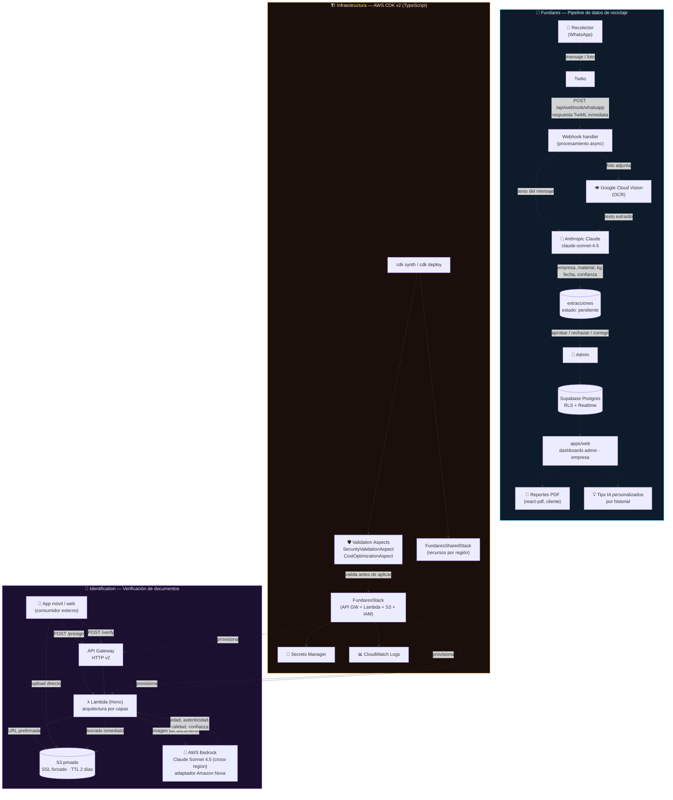
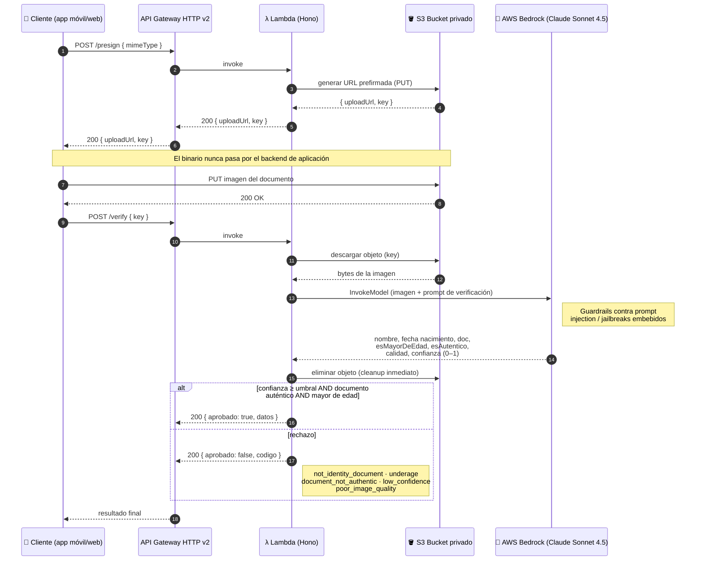
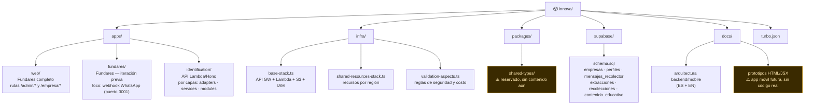
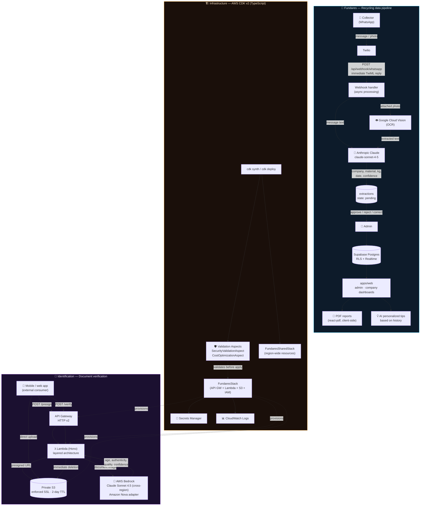
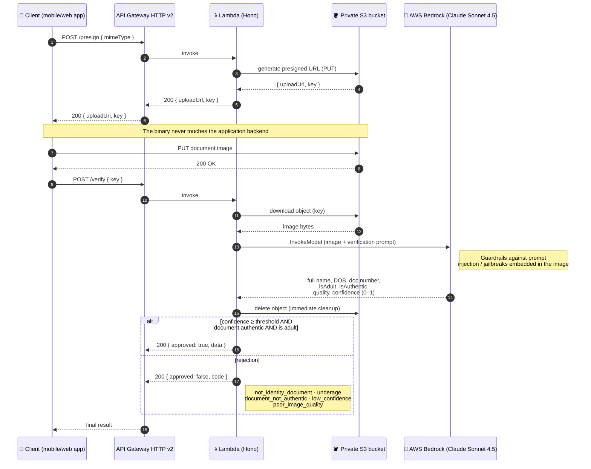
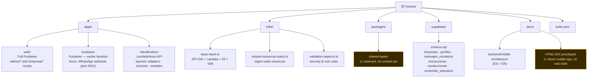

  

  

  
  
  
  
  
  
  
  

  

  <a href="#español">🇪🇸 Español</a> · <a href="#english">🇬🇧 English</a>

---

## Español

### Tabla de contenidos

- [¿Qué es esto?](#qué-es-esto)
- [Arquitectura](#arquitectura)
- [Flujo de verificación de identidad (secuencia)](#flujo-de-verificación-de-identidad-secuencia)
- [Características principales](#características-principales)
- [Stack tecnológico](#stack-tecnológico)
- [Estructura del proyecto](#estructura-del-proyecto)
- [Estado del proyecto y roadmap](#estado-del-proyecto-y-roadmap)
- [Licencia](#licencia)
- [Autor](#autor--contacto)

---

### ¿Qué es esto?

**Innova** es un monorepo (`npm workspaces` + `Turborepo`) que agrupa **dos productos independientes**, construidos alrededor de modelos de IA generativa y visión, que comparten filosofía de arquitectura pero resuelven problemas completamente distintos:

| | Fundares | Identification |
|---|---|---|
| **Qué hace** | Convierte mensajes de WhatsApp de recolectores de reciclaje en registros estructurados y validados | Verifica edad y autenticidad de documentos de identidad a partir de una foto |
| **Entrada** | Texto + fotos vía Twilio WhatsApp | Imagen de documento subida por el cliente |
| **Cerebro IA** | Anthropic Claude (`claude-sonnet-4-5`) + Google Cloud Vision (OCR) | AWS Bedrock — Claude Sonnet 4.5 (perfil cross-region) / Amazon Nova |
| **Persistencia** | Supabase (Postgres + RLS + Realtime) | S3 con expiración automática (2 días) — no se retiene la imagen tras verificar |
| **Consumidores** | Dashboards web `admin` / `empresa` | Apps móviles/web externas vía API REST |
| **Despliegue** | Next.js (Vercel/Node) | AWS Lambda (Hono) o contenedor ECS, provisionado con AWS CDK v2 |

El patrón común a ambos servicios evita que archivos pesados (fotos, documentos) pasen por el backend de aplicación: **subida directa a almacenamiento de objetos → análisis con un modelo de lenguaje multimodal → resultado estructurado con nivel de confianza**. Esto reduce latencia, costo de cómputo y superficie de ataque.

> **Nota honesta sobre el estado del código (importante para quien evalúe este repo):**
> Este es un monorepo de trabajo con **dos generaciones de la app web de Fundares** conviviendo sin resolución formal: `apps/web` (más completa, con paneles diferenciados admin/empresa) y `apps/fundares` (una iteración más temprana, centrada exclusivamente en el webhook de WhatsApp). Además, `LICENSE`, `SECURITY.md` y el `package.json` raíz (`"name": "decouple-services"`) apuntan a **Walter Ibanez** como autor original, lo que sugiere que este repositorio es (o parte de) un **fork o derivado** de un proyecto llamado `decouple-services`. Por su parte, `CONTRIBUTING.md` y `CHANGELOG.md` describen una **app móvil Flutter** y **workflows de CI/CD** que **no existen** en este snapshot del código — probablemente documentación heredada de un estado anterior o de un repositorio hermano. Este README describe únicamente lo que **realmente existe** en el árbol de archivos actual, sin inventar ni asumir funcionalidad no verificada.

---

### Arquitectura

El siguiente diagrama muestra los dos servicios de punta a punta, incluyendo dónde entra la IA y qué provisiona la infraestructura como código:

---

### Flujo de verificación de identidad (secuencia)

Detalle del flujo de dos pasos (`presign` → `upload` → `verify`) que usa **Identification** para nunca exponer credenciales de subida ni retener imágenes sensibles:

---

### Características principales

**🔄 Fundares (`apps/fundares` y `apps/web`)**
- Recepción de mensajes de WhatsApp vía webhook de Twilio (`POST /api/webhook/whatsapp`), con respuesta inmediata en TwiML y procesamiento asíncrono en segundo plano — el recolector nunca espera a que termine la extracción IA.
- Extracción automática de datos de reciclaje (empresa, tipo de material, cantidad en kg, fecha, notas, nivel de confianza) usando la API de Anthropic Claude (`claude-sonnet-4-5`) a partir del texto del mensaje y, opcionalmente, texto extraído por OCR de fotos adjuntas (Google Cloud Vision).
- Flujo de validación humana en el centro del diseño: las extracciones quedan en estado `pendiente` y un administrador puede `aprobar`, `rechazar` o `corregir` los datos antes de que se conviertan en una "recolección" oficial — la IA nunca escribe directamente en la tabla de verdad.
- Dashboards separados por rol (`admin` y `empresa`) con **Row Level Security (RLS)** en Supabase/Postgres, de forma que cada empresa solo ve sus propios datos a nivel de base de datos, no solo de UI.
- Cálculo de métricas de impacto ambiental por empresa y por año (kg reciclados por mes, desglose por tipo de material, comparación interanual).
- Generación de reportes en PDF en el cliente con `@react-pdf/renderer`, sin depender de un servicio de renderizado server-side.
- Contenido educativo sobre reciclaje (artículos, videos, infografías) publicable por administradores.
- Generación de tips personalizados de reciclaje por empresa usando IA, en base a su historial de recolecciones.
- Autenticación y autorización mediante Supabase Auth + middleware de Next.js que redirige según sesión y rol.

**🪪 Identification (`apps/identification`)**
- API REST serverless sobre AWS Lambda con el framework [Hono](https://hono.dev), compilada con esbuild para arranque en frío mínimo.
- Flujo de dos pasos desacoplado: `POST /presign` (URL prefirmada de S3) → subida directa del cliente a S3 → `POST /verify` (análisis y borrado inmediato de la imagen) — el backend de aplicación nunca maneja el binario de la imagen.
- Verificación de edad y autenticidad de documentos de identidad mediante Claude Sonnet 4.5 sobre un **perfil de inferencia cross-region de AWS Bedrock**.
- Extracción estructurada: nombre completo, fecha de nacimiento, número de documento, si es mayor de edad, si el documento parece auténtico, calidad de imagen y confianza (0–1).
- Códigos de rechazo explícitos y tipados: `not_identity_document`, `underage`, `document_not_authentic`, `low_confidence`, `poor_image_quality` — el cliente nunca tiene que parsear texto libre para saber por qué falló.
- Guardrails contra inyección de prompts y jailbreaks embebidos en la imagen del documento (defensa contra ataques adversariales dirigidos al modelo).
- Adaptadores intercambiables de modelos Bedrock (`bedrock-adapter.interface.ts`, adaptadores para Claude y para Amazon Nova), lo que permite cambiar de proveedor de IA sin tocar la lógica de negocio — un patrón *ports & adapters* aplicado a IA generativa.
- Suite de pruebas con Jest y script de prueba local (`scripts/test-local.ts`).
- Soporte para ejecutarse tanto como Lambda (`build:lambda`) como en modo servidor/contenedor ECS (`build:ecs`, con Docker Compose incluido para Postgres local).

**🏗️ Infraestructura (`infra/`)**
- AWS CDK v2 (TypeScript) con stacks separados: recursos compartidos por región (`FundaresSharedStack`) y stack principal (`FundaresStack`) con API Gateway HTTP v2 + Lambda + S3 + IAM + Secrets Manager + CloudWatch Logs.
- **Aspects de validación personalizados** que se ejecutan en cada `cdk synth`/`cdk deploy`, actuando como *policy-as-code*:
  - `SecurityValidationAspect` — detecta cifrado RDS faltante, security groups permisivos, roles IAM con wildcards.
  - `CostOptimizationAspect` — detecta configuraciones costosas en entornos de desarrollo antes de que lleguen a desplegarse.
- Bucket S3 con acceso privado, SSL forzado y regla de expiración automática de objetos temporales (2 días) — las imágenes de documentos nunca se acumulan indefinidamente.

---

### Stack tecnológico

| Categoría | Tecnología |
|---|---|
| Monorepo | npm workspaces + [Turborepo](https://turborepo.dev) 2.9, TypeScript 5.9, Prettier 3.7 |
| Web (`apps/web`) | Next.js 14.2 (App Router), React 18.3, Tailwind CSS 3.4, Recharts, `@react-pdf/renderer`, Supabase (`@supabase/ssr`), Anthropic SDK |
| Web (`apps/fundares`) | Next.js 14.2, React 18.3, TanStack React Query 5.80, Zod, Twilio SDK, `date-fns`, Supabase |
| Base de datos | PostgreSQL vía Supabase — Row Level Security, Realtime (tablas `recolecciones` y `extracciones`) |
| IA — Fundares | Anthropic Claude (`claude-sonnet-4-5`), Google Cloud Vision (OCR) |
| Identification API | Node.js 22, [Hono](https://hono.dev) 4.6, esbuild, AWS Bedrock (Claude Sonnet 4.5 vía perfil de inferencia cross-region, adaptador para Amazon Nova) |
| Infraestructura | AWS CDK v2, API Gateway HTTP v2, AWS Lambda, S3, Secrets Manager, CloudWatch, IAM |
| Testing | Jest + ts-jest (Identification), Jest (infra CDK) |
| Calidad de código | ESLint, Prettier, TypeScript strict, EditorConfig |

---

### Estructura del proyecto

Detalle por carpeta:

- **`apps/web`**: la versión más completa de Fundares. Incluye rutas protegidas `/admin/*` (dashboard, gestión de empresas, validación de extracciones, reportes) y `/empresa/*` (dashboard propio, contenido educativo, reportes), componentes de UI reutilizables (`components/ui`), gráficos separados por tipo (`BarChart`, `LineChart`, `PieChart`) y generación de PDF (`lib/pdf.ts`).
- **`apps/fundares`**: corre en el puerto 3001, expone el webhook de Twilio WhatsApp, la lógica de extracción con Claude (`lib/claude.ts`) y OCR (`lib/ocr.ts`), y usa TanStack Query para el estado del cliente.
- **`apps/identification`**: servicio Lambda con arquitectura por capas (`common/adapters`, `common/services`, `common/exceptions`, `config`, `modules/identification`). El módulo `identification` contiene el controlador, DTOs, servicio de negocio y cálculo de "pricing" (costo por verificación).
- **`infra`**: define `base-stack.ts` (API Gateway + Lambda + S3 + IAM + Secrets Manager + CloudWatch) y `shared-resources-stack.ts` (recursos compartidos por región), más `validation-aspects.ts` con reglas de seguridad y costo aplicadas automáticamente en cada síntesis.
- **`supabase/schema.sql`**: define las tablas `empresas`, `perfiles`, `mensajes_recolector`, `extracciones`, `recolecciones` y `contenido_educativo`, con políticas RLS por rol (`admin` / `empresa`) y publicación Realtime.
- **`docs/`**: documentación en inglés y español sobre arquitectura backend/mobile, integración con el cliente, integración frontend y costos de Bedrock; incluye también prototipos de diseño (HTML/JSX) de una función de verificación de edad para una futura app móvil.

---

### Estado del proyecto y roadmap

- [x] Servicio **Fundares** funcional de extremo a extremo: WhatsApp → extracción IA → validación humana → dashboards → reportes PDF.
- [x] Servicio **Identification** funcional de extremo a extremo: presign → upload S3 → verificación con Bedrock → códigos de rechazo tipados.
- [x] Infraestructura como código (AWS CDK v2) con validación automática de seguridad y costo en cada despliegue.
- [x] Esquema completo de base de datos con RLS y Realtime para Fundares.
- [ ] Consolidar `apps/web` y `apps/fundares` en una sola aplicación — hoy conviven dos generaciones de la misma app sin que quede documentado formalmente cuál reemplaza a cuál.
- [ ] Poblar `packages/shared-types`, declarado en el workspace pero aún sin tipos compartidos entre apps.
- [ ] Definir si la app móvil (Flutter) descrita en `CONTRIBUTING.md`/`CHANGELOG.md` se retoma — actualmente solo existen prototipos de diseño HTML/JSX en `docs/`, sin código Flutter en el repositorio.
- [ ] Configurar workflows de CI/CD (`.github/workflows`) — descritos en la documentación heredada pero ausentes en este snapshot.

> ⚠️ **Nota de procedencia:** `LICENSE`, `SECURITY.md` y `package.json` (`"name": "decouple-services"`) indican que este proyecto desciende de un repositorio anterior atribuido a **Walter Ibanez**. Parte de la documentación (`CONTRIBUTING.md`, `CHANGELOG.md`) describe funcionalidad (app Flutter, pipeline de CI/CD) que corresponde a ese estado anterior y **no está presente** en este snapshot del código. Se deja constancia aquí en lugar de silenciarlo u homogeneizar la narrativa.

---

### Licencia

Este proyecto está licenciado bajo la **Licencia MIT** (heredada del repositorio original) — ver el archivo [`LICENSE`](LICENSE).

---

### Autor / Contacto

  

- Repositorio: [github.com/jackson1939/innova](https://github.com/jackson1939/innova)

---
---

## English

### Table of contents

- [What is this?](#what-is-this)
- [Architecture](#architecture)
- [Identity verification flow (sequence)](#identity-verification-flow-sequence)
- [Key features](#key-features)
- [Tech stack](#tech-stack)
- [Project structure](#project-structure)
- [Project status & roadmap](#project-status--roadmap)
- [License](#license)
- [Author](#author--contact)

---

### What is this?

**Innova** is an npm-workspaces + Turborepo monorepo bundling **two independent products**, both built around generative AI and vision models, sharing an architectural philosophy while solving completely different problems:

| | Fundares | Identification |
|---|---|---|
| **What it does** | Turns WhatsApp messages from recycling collectors into structured, validated records | Verifies age and authenticity of identity documents from a photo |
| **Input** | Text + photos via Twilio WhatsApp | Document image uploaded by the client |
| **AI brain** | Anthropic Claude (`claude-sonnet-4-5`) + Google Cloud Vision (OCR) | AWS Bedrock — Claude Sonnet 4.5 (cross-region profile) / Amazon Nova |
| **Persistence** | Supabase (Postgres + RLS + Realtime) | S3 with automatic expiry (2 days) — the image is not retained after verification |
| **Consumers** | `admin` / `empresa` web dashboards | External mobile/web apps via REST API |
| **Deployment** | Next.js (Vercel/Node) | AWS Lambda (Hono) or ECS container, provisioned via AWS CDK v2 |

The pattern shared by both services keeps heavy files (photos, documents) out of the application backend: **direct upload to object storage → analysis with a multimodal language model → structured result with a confidence score**. This reduces latency, compute cost and attack surface.

> **Honest note on code state (important for anyone evaluating this repo):**
> This is a working monorepo with **two generations of the Fundares web app** coexisting with no formal resolution: `apps/web` (the more complete one, with separate admin/company dashboards) and `apps/fundares` (an earlier iteration focused solely on the WhatsApp webhook). In addition, `LICENSE`, `SECURITY.md` and the root `package.json` (`"name": "decouple-services"`) point to **Walter Ibanez** as the original author, suggesting this repository is (or is part of) a **fork or derivative** of a project called `decouple-services`. Meanwhile, `CONTRIBUTING.md` and `CHANGELOG.md` describe a **Flutter mobile app** and **CI/CD workflows** that **do not exist** in this code snapshot — most likely legacy documentation from an earlier state or a sibling repository. This README documents only what **actually exists** in the current file tree, without inventing or assuming unverified functionality.

---

### Architecture

The diagram below shows both services end to end, including where AI comes in and what the infrastructure-as-code layer provisions:

---

### Identity verification flow (sequence)

Detail of the two-step flow (`presign` → `upload` → `verify`) used by **Identification** to never expose upload credentials and never retain sensitive images:

---

### Key features

**🔄 Fundares (`apps/fundares` and `apps/web`)**
- Receives WhatsApp messages via a Twilio webhook (`POST /api/webhook/whatsapp`), replying immediately with TwiML and processing asynchronously in the background — the collector never waits for the AI extraction to finish.
- Automatic extraction of recycling data (company, material type, quantity in kg, date, notes, confidence score) using the Anthropic Claude API (`claude-sonnet-4-5`) from the message text and, optionally, OCR text extracted from attached photos (Google Cloud Vision).
- Human validation workflow at the core of the design: extractions stay in a `pendiente` (pending) state and an admin can `aprobar` (approve), `rechazar` (reject) or `corregir` (correct) the data before it becomes an official collection record — the AI never writes directly to the source of truth.
- Role-based dashboards (`admin` and `empresa`) with **Row Level Security (RLS)** in Supabase/Postgres, so each company only sees its own data at the database level, not just in the UI.
- Environmental impact metrics per company and per year (kg recycled per month, breakdown by material type, year-over-year comparison).
- Client-side PDF report generation with `@react-pdf/renderer`, with no dependency on a server-side rendering service.
- Publishable educational content about recycling (articles, videos, infographics).
- AI-generated personalized recycling tips per company, based on collection history.
- Authentication and authorization via Supabase Auth plus a Next.js middleware that redirects based on session and role.

**🪪 Identification (`apps/identification`)**
- Serverless REST API on AWS Lambda using the [Hono](https://hono.dev) framework, bundled with esbuild for minimal cold starts.
- Decoupled two-step flow: `POST /presign` (presigned S3 URL) → client uploads directly to S3 → `POST /verify` (analysis and immediate deletion of the image) — the application backend never handles the image binary.
- Age and document-authenticity verification via Claude Sonnet 4.5 on an **AWS Bedrock cross-region inference profile**.
- Structured extraction: full name, date of birth, document number, whether the person is an adult, whether the document appears authentic, image quality and confidence (0–1).
- Explicit, typed rejection codes: `not_identity_document`, `underage`, `document_not_authentic`, `low_confidence`, `poor_image_quality` — the client never has to parse free text to know why a check failed.
- Guardrails against prompt injection and jailbreak attempts embedded in the document image (defense against adversarial attacks targeting the model).
- Swappable Bedrock model adapters (`bedrock-adapter.interface.ts`, adapters for Claude and Amazon Nova), allowing the AI provider to be changed without touching business logic — a *ports & adapters* pattern applied to generative AI.
- Jest test suite plus a local test script (`scripts/test-local.ts`).
- Can run both as a Lambda (`build:lambda`) and as a server/ECS container (`build:ecs`, with Docker Compose included for local Postgres).

**🏗️ Infrastructure (`infra/`)**
- AWS CDK v2 (TypeScript) with separate stacks: region-wide shared resources (`FundaresSharedStack`) and the main stack (`FundaresStack`) with HTTP API Gateway v2 + Lambda + S3 + IAM + Secrets Manager + CloudWatch Logs.
- **Custom validation Aspects** run on every `cdk synth`/`cdk deploy`, acting as *policy-as-code*:
  - `SecurityValidationAspect` — flags missing RDS encryption, permissive security groups, wildcard IAM roles.
  - `CostOptimizationAspect` — flags costly configurations in dev environments before they ever get deployed.
- Private S3 bucket with enforced SSL and an automatic lifecycle rule expiring temporary objects after 2 days — document images never accumulate indefinitely.

---

### Tech stack

| Category | Technology |
|---|---|
| Monorepo | npm workspaces + [Turborepo](https://turborepo.dev) 2.9, TypeScript 5.9, Prettier 3.7 |
| Web (`apps/web`) | Next.js 14.2 (App Router), React 18.3, Tailwind CSS 3.4, Recharts, `@react-pdf/renderer`, Supabase (`@supabase/ssr`), Anthropic SDK |
| Web (`apps/fundares`) | Next.js 14.2, React 18.3, TanStack React Query 5.80, Zod, Twilio SDK, `date-fns`, Supabase |
| Database | PostgreSQL via Supabase — Row Level Security, Realtime (`recolecciones` and `extracciones` tables) |
| AI — Fundares | Anthropic Claude (`claude-sonnet-4-5`), Google Cloud Vision (OCR) |
| Identification API | Node.js 22, [Hono](https://hono.dev) 4.6, esbuild, AWS Bedrock (Claude Sonnet 4.5 via cross-region inference profile, Amazon Nova adapter) |
| Infrastructure | AWS CDK v2, HTTP API Gateway v2, AWS Lambda, S3, Secrets Manager, CloudWatch, IAM |
| Testing | Jest + ts-jest (Identification), Jest (CDK infra) |
| Code quality | ESLint, Prettier, strict TypeScript, EditorConfig |

---

### Project structure

Per-folder detail:

- **`apps/web`**: the most complete version of Fundares. Includes protected `/admin/*` routes (dashboard, company management, extraction validation, reports) and `/empresa/*` routes (own dashboard, educational content, reports), reusable UI components (`components/ui`), per-type charts (`BarChart`, `LineChart`, `PieChart`) and PDF generation (`lib/pdf.ts`).
- **`apps/fundares`**: runs on port 3001, exposes the Twilio WhatsApp webhook, the Claude-based extraction logic (`lib/claude.ts`) and OCR (`lib/ocr.ts`), and uses TanStack Query for client state.
- **`apps/identification`**: a layered Lambda service (`common/adapters`, `common/services`, `common/exceptions`, `config`, `modules/identification`). The `identification` module holds the controller, DTOs, business service and per-verification pricing calculation.
- **`infra`**: defines `base-stack.ts` (API Gateway + Lambda + S3 + IAM + Secrets Manager + CloudWatch) and `shared-resources-stack.ts` (region-wide shared resources), plus `validation-aspects.ts` with automatically-applied security and cost rules on every synthesis.
- **`supabase/schema.sql`**: defines the `empresas`, `perfiles`, `mensajes_recolector`, `extracciones`, `recolecciones` and `contenido_educativo` tables, with role-based RLS policies (`admin` / `empresa`) and Realtime publication.
- **`docs/`**: English and Spanish documentation on backend/mobile architecture, client integration, frontend integration and Bedrock costs; it also includes design prototypes (HTML/JSX) for a future age-verification mobile app.

---

### Project status & roadmap

- [x] **Fundares** service functional end to end: WhatsApp → AI extraction → human validation → dashboards → PDF reports.
- [x] **Identification** service functional end to end: presign → S3 upload → Bedrock verification → typed rejection codes.
- [x] Infrastructure as code (AWS CDK v2) with automatic security and cost validation on every deploy.
- [x] Full database schema with RLS and Realtime for Fundares.
- [ ] Consolidate `apps/web` and `apps/fundares` into a single application — two generations of the same app currently coexist with no formal documentation on which supersedes the other.
- [ ] Populate `packages/shared-types`, declared in the workspace but still without any shared types between apps.
- [ ] Decide whether the Flutter mobile app described in `CONTRIBUTING.md`/`CHANGELOG.md` is picked back up — currently only HTML/JSX design prototypes exist under `docs/`, with no Flutter code in the repository.
- [ ] Set up CI/CD workflows (`.github/workflows`) — described in legacy documentation but absent from this snapshot.

> ⚠️ **Provenance note:** `LICENSE`, `SECURITY.md` and `package.json` (`"name": "decouple-services"`) indicate this project descends from an earlier repository attributed to **Walter Ibanez**. Part of the documentation (`CONTRIBUTING.md`, `CHANGELOG.md`) describes functionality (Flutter app, CI/CD pipeline) belonging to that earlier state, which is **not present** in this code snapshot. This is stated here explicitly rather than smoothed over.

---

### License

This project is licensed under the **MIT License** (inherited from the original repository) — see the [`LICENSE`](LICENSE) file.

---

### Author / Contact

  

- Repository: [github.com/jackson1939/innova](https://github.com/jackson1939/innova)

  

